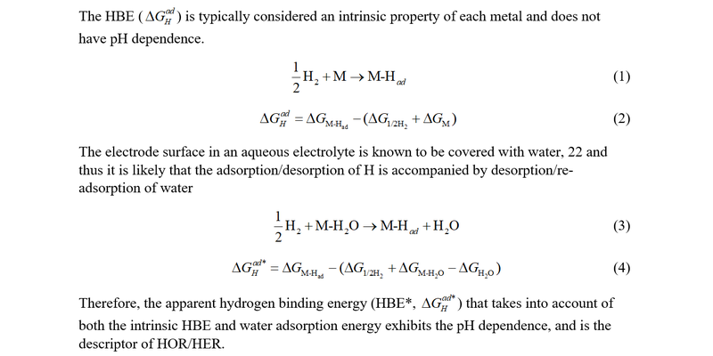
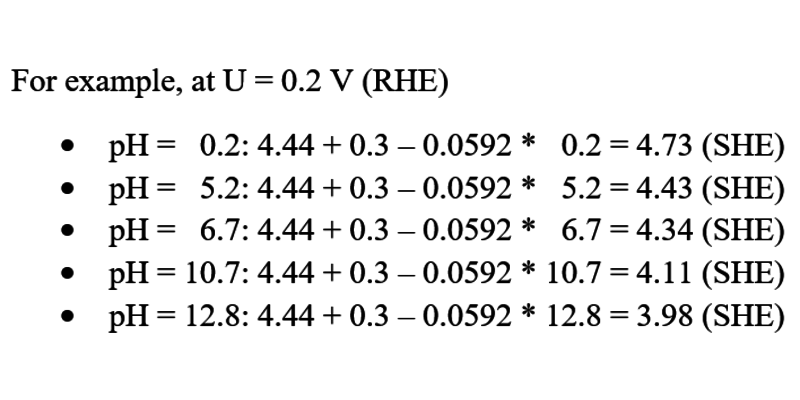
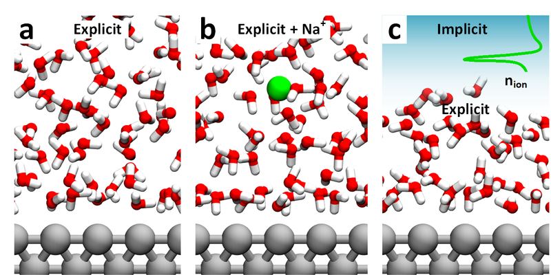
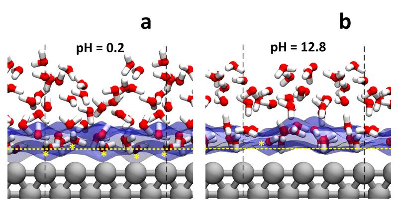
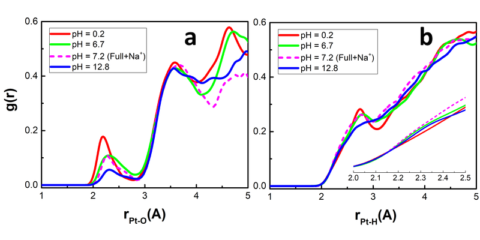
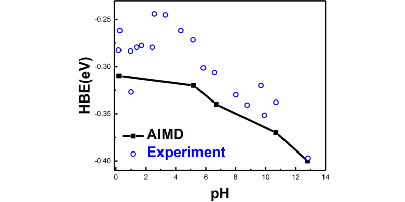

---

@title[Title]
### Two State Reactivity of Iron SAC in Reducing CO2

Tao Cheng

---

@title[Introduction]
- The Fe catalyst (Fe3+–N–C) was prepared through the pyrolysis of Fe-doped Zn ZIF-8 under N2 at 900 C
- The precursor adopts the same crystal structure as that of undoped ZIF-8, with a mole ratio of Fe:Zn of 4:96
- Fe ions occupy Zn sites and are coordinated by four pyrrolic-type N, as revealed by the fitting of the Fe K-edge EXAFS spectrum

---
- The performance of Fe3+–N–C was stable between –0.2 and –0.5 V versus RHE.
- at potentials more negative than –0.5 V versus RHE, the activity became unstable
---
- For Fe3+–N–C, the Fe K-edge showed no obvious shift between the dry powder and the in situ sample at –0.4 V versus RHE. The edge energy was close to that of Fe3+TPPCl, indicating that the Fe ions in Fe3+–N–C remained in the +3 oxidation state during CO2 electroreduction at potentials as negative as –0.4 V versus RHE.
- When the applied potential was shifted further negative, to –0.5 V versus RHE and beyond, the Fe K-edge shifted to lower energies, which were comparable with that of FeO, suggesting the reduction of Fe3+ to Fe2+.
---
- we prepared the reference sample (Fe2+–N–C) by pyrolysis of a composite containing a Fe-phenanthroline complex at 700°C
- The Fe 2p XPS (fig. S14C) spectrum showed that the binding energy of Fe ion was similar to that of Fe2O3.  These data suggested an important number of Fe3+ sites in the as-prepared sample of Fe2+–N–C.
- The in situ XANES (Fig. 3B) showed that Fe3+ in the as-prepared Fe2+–N–C started to be reduced to Fe2+ at –0.1 to –0.2 V versus RHE. 
---
- the jCO of Fe3+–N–C is approximately first-order in the concentration of HCO3
- a Tafel slope of 64-71 mV/decade at low overpotentials
- These kinetic data suggest that for Fe3+–N–C, the 1 electron reduction of CO2 is also decoupled from a proton transfer.
- Moreover, CO2 adsorption is fast, and the ratelimiting step is the protonation of the adsorbed CO2 to form an adsorbed COOH intermediate

---
100-fold activity decrease going from low to high pH

  

Durst et al. Energy Environ. Sci., 2014, 7, 2255
---
HBE increases with increasing pH

  

Sheng et al.  Nat Commun, 2015, 6

---
HBE increases with increasing pH

  

Sheng et al.  Nat Commun, 2015, 6

---
### Some explainations
- Faster formation of H* from H plus than from H2O. (Strmcnik et al. Nano Energy, 2016) 
- The pH dependence of entropy change from the proton transfer from the bulk solution into the outer Helmholz layer. (Rossmeisl et al. Catalysis Today, 2016)
- Partial oxidation of water adsorption on step sites of metals (Schwarz et al. Phys. Chem. Chem. Phys. 2016)
- Weakened OH adsorption strength induced by the co-adsorption of cation (McCrum et al. J. Phys. Chem. C, 2016)

---

---
### Our hypothesis
The pH-dependence of the HBE is from change of water adsorption due to the change of applied potential.

---
Difference in pH at RHE scale is the difference in potential at SHE scale.
  

---
simulate the interface under applied potential
    

 workfuction: water/Pt(100) = 5.06 eV water+Na/Pt(100) = 4.38 eV   
 experiment pzc: water/Pt(100) = 4.85 eV 

---
    

---

---
Binding Energy 

---
Simulate the interface from explicit simulation:  

- At pH 0.2 (HClO4), the experiment Hupd peak of Pt(100) appears at about 0.3 V.  
- At pH 5.2 (Acetate buffer), the experiment Hupd peak of Pt(100) appears at about 0.25 V.  
- At pH 12.8 (KOH), the experiment Hupd peak of Pt(100) appears at about 0.4 V.  

Thus the voltage we interested with are:  
 4.4 + 0.30 -  0.2 x 0.0592 = 4.69;
 4.4 + 0.25 -  5.2 x 0.0592 = 4.34;
 4.4 + 0.40 - 12.8 x 0.0592 = 4.04;  
set 1: 4.69 to 4.04;
set 2: 4.89 to 4.24;
set 3: 4.40, 3.98, 3.57

simulation results:  
00e: 5.0;
10e: 4.0;
20e: 3.0  
04e, 10e, 14e

---
### Reduce the full explicit simulation to semi-explicit simulation

---
### The interface structure from simulation

---
### The rdf 

---
### Github

