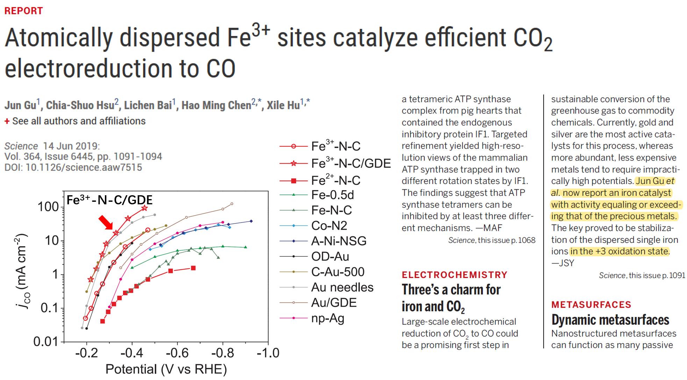
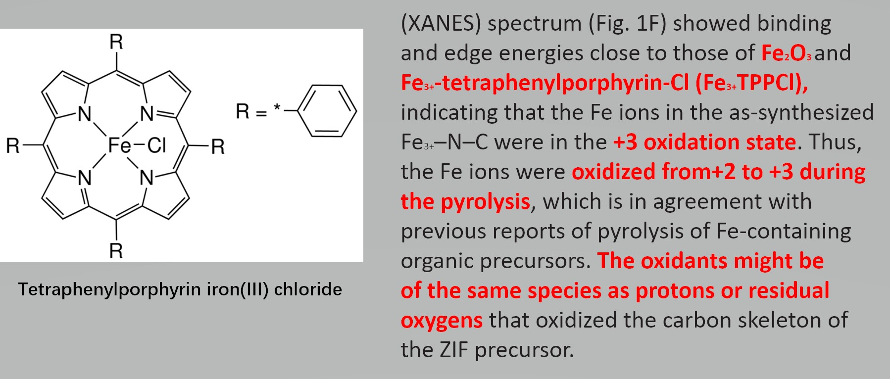
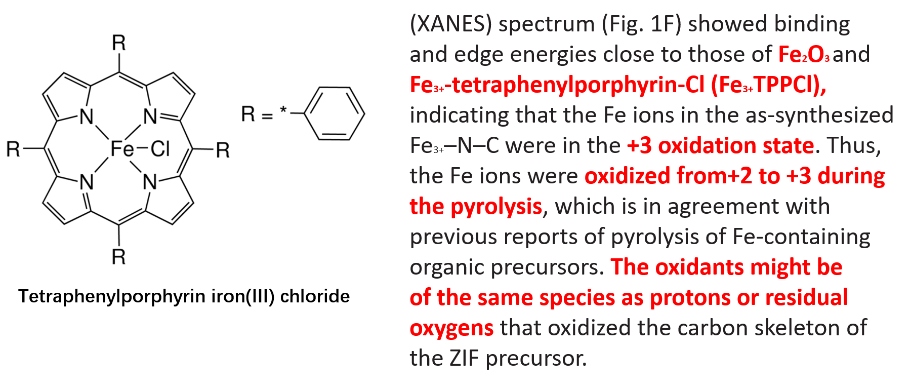
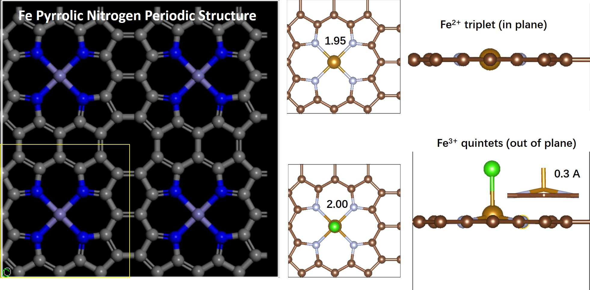
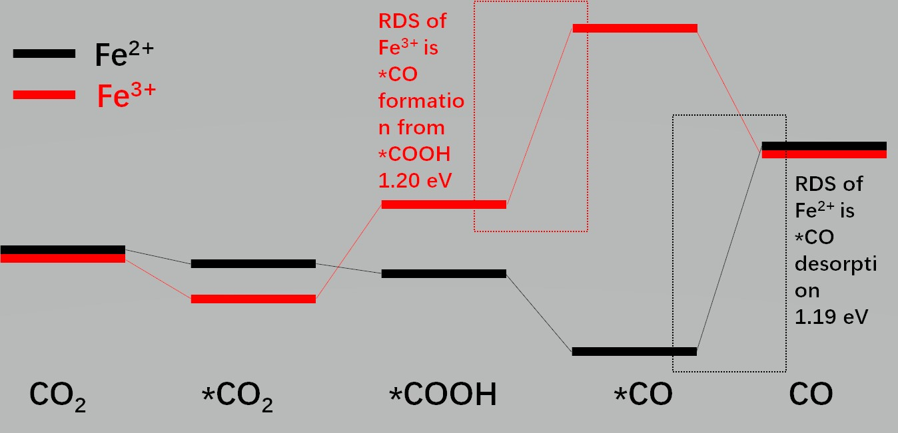

---

@title[Title]
### Two State Reactivity of Iron SAC in Reducing CO2

Tao Cheng

---
  
---

@title[Introduction]
- The Fe catalyst (Fe3+–N–C) was prepared through the pyrolysis of Fe-doped Zn ZIF-8 under N2 at 900 C
- The precursor adopts the same crystal structure as that of undoped ZIF-8, with a mole ratio of Fe:Zn of 4:96
- Fe ions occupy Zn sites and are coordinated by four pyrrolic-type N, as revealed by the fitting of the Fe K-edge EXAFS spectrum
---
  
---
  
---
  
---
  
---
- The performance of Fe3+–N–C was stable between –0.2 and –0.5 V versus RHE.
- at potentials more negative than –0.5 V versus RHE, the activity became unstable
---
- For Fe3+–N–C, the Fe K-edge showed no obvious shift between the dry powder and the in situ sample at –0.4 V versus RHE. The edge energy was close to that of Fe3+TPPCl, indicating that the Fe ions in Fe3+–N–C remained in the +3 oxidation state during CO2 electroreduction at potentials as negative as –0.4 V versus RHE.
- When the applied potential was shifted further negative, to –0.5 V versus RHE and beyond, the Fe K-edge shifted to lower energies, which were comparable with that of FeO, suggesting the reduction of Fe3+ to Fe2+.
---
- we prepared the reference sample (Fe2+–N–C) by pyrolysis of a composite containing a Fe-phenanthroline complex at 700°C
- The Fe 2p XPS (fig. S14C) spectrum showed that the binding energy of Fe ion was similar to that of Fe2O3.  These data suggested an important number of Fe3+ sites in the as-prepared sample of Fe2+–N–C.
- The in situ XANES (Fig. 3B) showed that Fe3+ in the as-prepared Fe2+–N–C started to be reduced to Fe2+ at –0.1 to –0.2 V versus RHE. 
---
- the jCO of Fe3+–N–C is approximately first-order in the concentration of HCO3
- a Tafel slope of 64-71 mV/decade at low overpotentials
- These kinetic data suggest that for Fe3+–N–C, the 1 electron reduction of CO2 is also decoupled from a proton transfer.
- Moreover, CO2 adsorption is fast, and the ratelimiting step is the protonation of the adsorbed CO2 to form an adsorbed COOH intermediate

---
- External CO did not influence the activity of Fe3+–N–C but largely
decreased the activity of Fe2+–N–C. 
- This result suggests that at high overpotentials, CO desorption becomes rate limiting for Fe2+–N–C.
- On the other hand, the reaction at Fe3+ sites was not limited by CO desorption and could reach a very high current
density. 
- Thus, the higher activity of Fe3+–N–C compared with Fe2+–N–C at high overpotentials can be rationalized by a weaker CO binding at an Fe3+ center than at an Fe2+ center.
---
@title[Conclusion]

