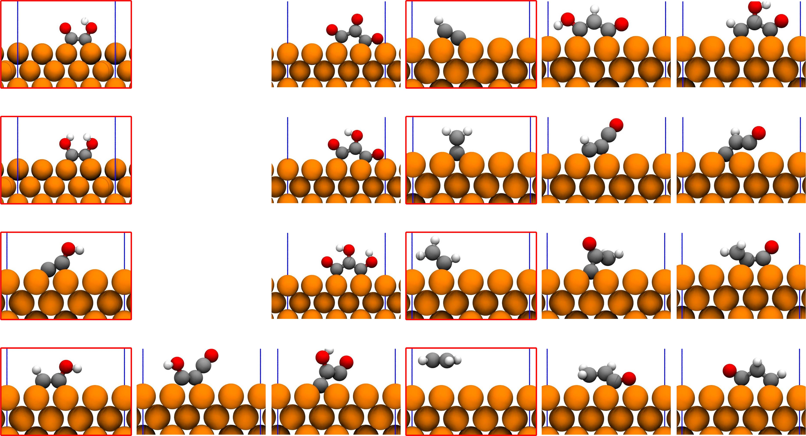
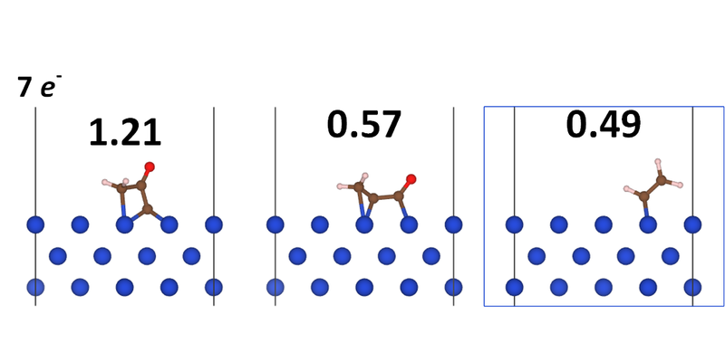
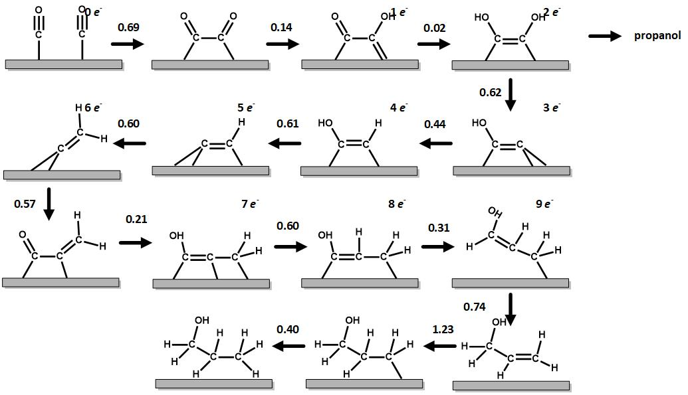
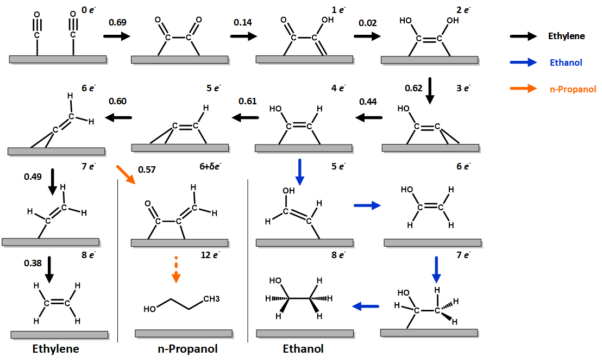
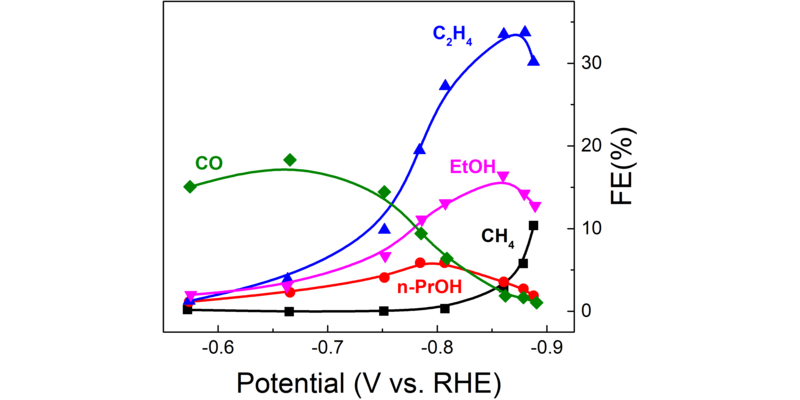

---

@title[Introduction]
### Tao Cheng
### Research Assistant
### JCAP, Caltech

Reaction mechanism of carbon dioxide reduction to propanol 

---

@title[Propanol is desired]
### n-Propanol is ideal.

<ol>
<li>
The fuel efficiency of propanol approaches gasoline
    <ul>
    <li>
    highest energy-mass density (30.93 kJ/g)
    </li>
    <li>
    highest octane number (118)
    </li>
    </ul>
</li>

<!-- highest energy-mass density (30.93 kJ/g) of the C1-C3 alcohols -->
<!-- highest octane number (118) of the C1-C3 alcohols -->

<li>
Deliver a cleaner burning blending with gasoline
</li>

<li>
Propanol has high market value.
</li>

</ol>

+++

@title[CO2RR]
### Produce propanol from CO2RR

<ol>
<li>
Current industrial production of propanol
    <ul>
    <li>
    ethylene is hydroformylated to propionaldehyde using cobalt or rhodium-based catalysis
    </li>
    <li>
    propionaldehyde is then reduced to propanol
    </li>
    </ul>
</li>

<li>
CO2RR could be a cost-effective method in producing propanol
    <ul>
    <li>
    $$3CO_2 + 13H_2O + 18e^- = C_3H_7OH + 18OH^-$$
    </li>
    <li>
    redox potential 0.21 V
    </li>
    </ul>
</li>

</ol>

---

@title[Current status]
### Current status

-  2003 Hori et al. Cu(100) FE = 1.5% j= -0.08 mA/cm2; 
-  2003 Hori et al. Cu(S)-[4(100)x(111)] FE = 4.6% j = -0.23 mA/cm2; 
-  2014 Kanan group Cu nanoparticles FE = 10.0% j = -0.08 at -0.4 V; 
-  2016 Ren et al. Cu nanocrystals j = -1.74 mA/cm2 at -0.95 V; 
-  2017 Peidong group Cu NP ensembles FE C2+C3 = 50% at -0.75 V; 
-  2016 Koper group Pd-Au C1-C5 at -0.8 V. 

---

@title[Reaction mechanism]
### Reaction mechanism:
### Ethylene and ethanol
<!--  @fa[hand-o-down fa-2x]  -->
+++?image=assets/fig-05.png&size=auto 80%
<!-- .slide: data-background-transition="none" -->
+++?image=assets/fig-06.png&size=auto 80%
<!-- .slide: data-background-transition="none" -->
+++
### Question:
### What is the reaction mechanism of n-propanol formation?
+++
@title[DFT results]  
We considered all C-C coupling possibilities

+++
<<<<<<< HEAD
@title[Most possible step]  
The most possible coupling step

+++
@title[propanol pathway] 
The reaction pathway of propanol formation

=======
@title[Overall reaction pathways]  
Overall reaction pathways.

>>>>>>> d5a7548e4c48a255f05637f9cd0b20c4ad47cccd
---
### Stay Hungry, Stay Foolish.
### 不忘初心，方得始终。
---
@title[Appendix]  
Experiment observations

n-PrOH is along with C2 (C2H4 and EtOH) production   

C3 compete with C1 (CH4) production   

