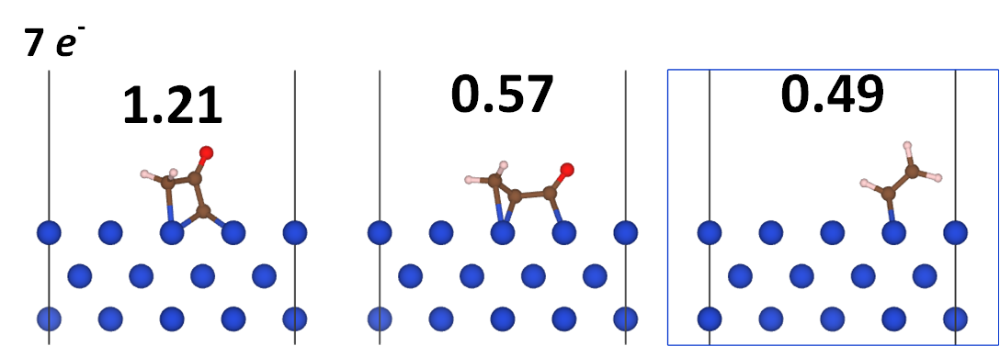
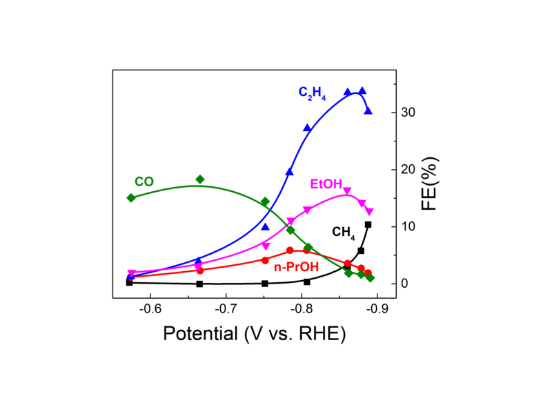

---

@title[Introduction]
### Tao Cheng
### Research Assistant
### JCAP, Caltech

Reaction mechanism of carbon dioxide reduction to propanol 

---

@title[Propanol is desired]
### Propanol is ideal production

<ol>
<li> 
The fuel efficiency of propanol approaches gasoline
    <ul>
    <li>
    highest energy-mass density (30.93 kJ/g) of the C1-C3 alcohols
    </li>
    <li>
    highest octane number (118) of the C1-C3 alcohols
    </li>
    </ul>
</li>

<!-- highest energy-mass density (30.93 kJ/g) of the C1-C3 alcohols -->
<!-- highest octane number (118) of the C1-C3 alcohols -->

<li>
Propanol can be blended with gasoline to deliver a cleaner burning
</li>

<li>
Propanol has high market value.
</li>

</ol>

+++

@title[CO2RR]
### Produce propanol from CO2RR

<ol>
<li>
Current industrial production of propanol
    <ul>
    <li>
    ethylene is hydroformylated to propionaldehyde using cobalt or rhodium-based catalysis
    </li>
    <li>
    propionaldehyde is then reduced to propanol
    </li>
    </ul>
</li>

<li> 
electrochemical reduction of CO2 to propanol could be a cost-effective method
    <ul>
    <li>
    3CO2 + 13H2O + 18e- = C3H7OH + 18OH- (E0 = 0.21 V)
    </li>
    </ul>
</li>

</ol>

---

@title[Current status]
### Current status

-  2003 Hori et al. Cu(100) FE = 1.5% j= -0.08 mA/cm2; 
-  2003 Hori et al. Cu(S)-[4(100)x(111)] FE = 4.6% j = -0.23 mA/cm2; 
-  2014 Kanan group Cu nanoparticles FE = 10.0% j = -0.08 at -0.4 V; 
-  2016 Ren et al. Cu nanocrystals j = -1.74 mA/cm2 at -0.95 V; 
-  2017 Peidong group Cu nanoparticle ensembles FE of C2+C3 = 50% at -0.75 V; 
-  2016 Koper group Pd-Au C1-C5 at -0.8 V. 

---

@title[Reaction mechanism]
### What is the reaction mechanism?

+++?image=assets/cv.png&size=auto 70%
@title[Experiment CV]

+++?image=assets/fig-02.png&size=auto 80%
@title[DFT results]

+++
@title[Most possible step]
### the most possible C2-CO coupling step

+++
@title[Test]
### This is a test

