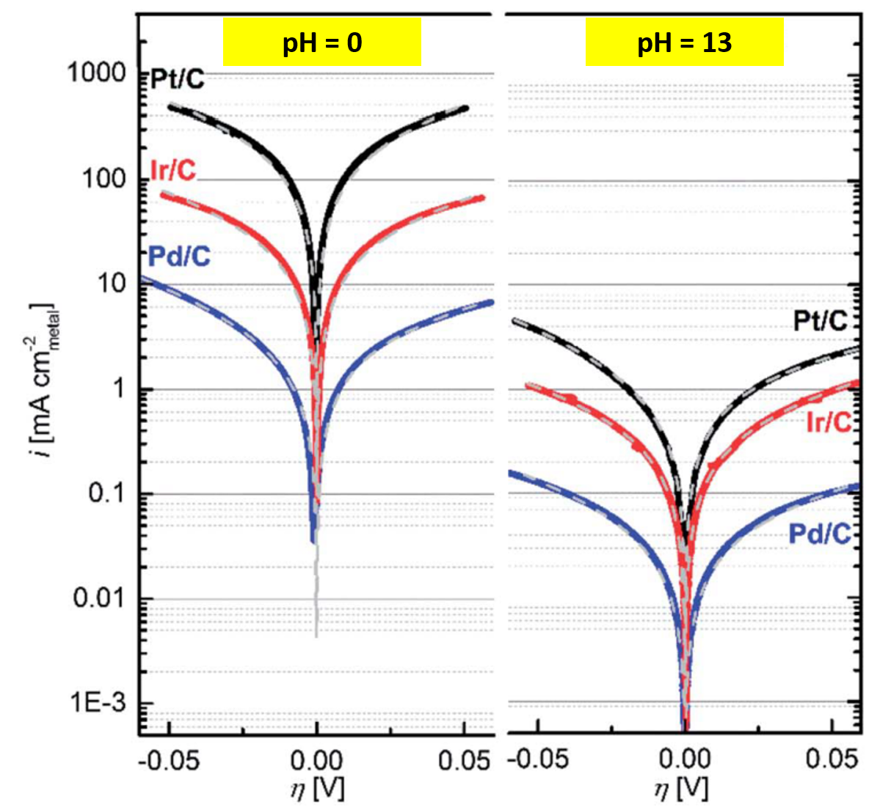

---

@title[Introduction]
### Tao Cheng
### Research Assistant
### JCAP, Caltech

HOR

---

@title[Introduction]
Hydrogen oxidation and evolution reactions (HOR/HER) are two of the key processes in renewable energy conversion and storage devices

---
For as yet unclear reasons, the HOR/HER kinetics on Pt are much slower in alkaline than in acid electrolytes. 

---

