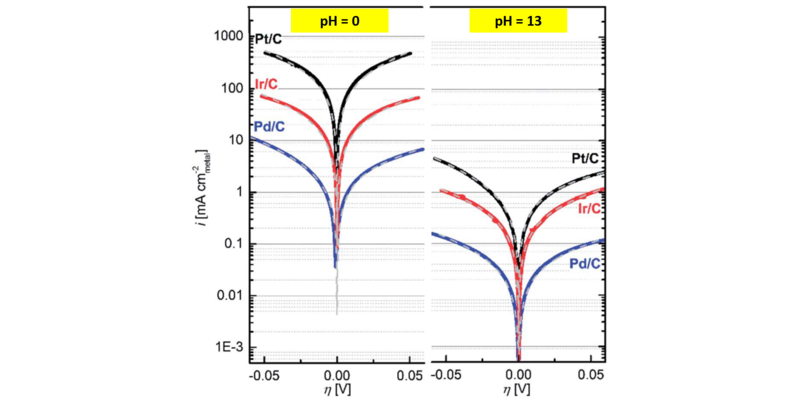
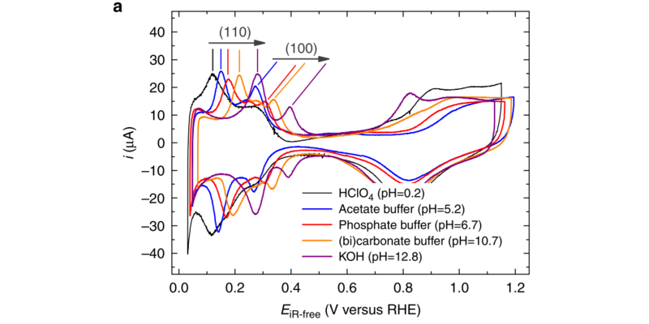
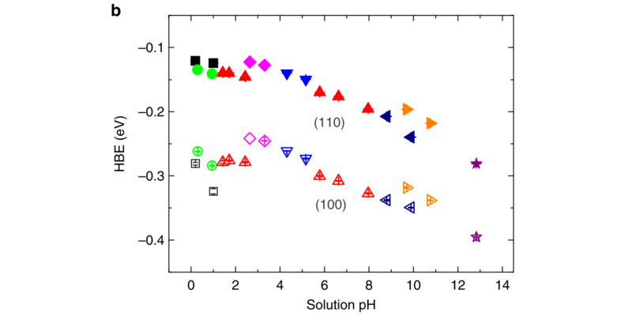

---

@title[Introduction]
### Tao Cheng
### Research Assistant
### JCAP, Caltech

HOR

---

@title[Introduction]
Hydrogen oxidation and evolution reactions (HOR/HER) are two of the key processes in renewable energy conversion and storage devices

---
For as yet unclear reasons, the HOR/HER kinetics on Pt are much slower in alkaline than in acid electrolytes. 

---
100-fold activity decrease going from low to high pH

  

Durst et al. Energy Environ. Sci., 2014, 7, 2255
---
HBE increases with increasing pH

  

Sheng et al.  Nat Commun, 2015, 6

---
HBE increases with increasing pH

  

Sheng et al.  Nat Commun, 2015, 6

---
### Some explainations
- Faster formation of H* from H plus than from H2O. (Strmcnik et al. Nano Energy, 2016) 
- The pH dependence of entropy change from the proton transfer from the bulk solution into the outer Helmholz layer. (Rossmeisl et al. Catalysis Today, 2016)
- Partial oxidation of water adsorption on step sites of metals (Schwarz et al. Phys. Chem. Chem. Phys. 2016)
- Weakened OH adsorption strength induced by the co-adsorption of cation (McCrum et al. J. Phys. Chem. C, 2016)

---
### Our hypothesis
The pH-dependence of the HBE is from change of water adsorption energy

---
##### Simulate the interface from explicit simulation

At pH 0.2 (HClO4), the experiment Hupd peak of Pt(100) appears at about 0.3 V.  
At pH 5.2 (Acetate buffer), the experiment Hupd peak of Pt(100) appears at about 0.25 V.  
At pH 12.8 (KOH), the experiment Hupd peak of Pt(100) appears at about 0.4 V.  

Thus the voltage we interested with are:  
 4.4 + 0.30 -  0.2 x 0.0592 = 4.69;
 4.4 + 0.25 -  5.2 x 0.0592 = 4.34;
 4.4 + 0.40 - 12.8 x 0.0592 = 4.04;  
set 1: 4.69 to 4.04;
set 2: 4.89 to 4.24;
set 3: 4.40, 3.98, 3.57

simulation results:  
00e: 5.0;
10e: 4.0;
20e: 3.0

simulations
04e, 10e, 14e

---
### Reduce the full explicit simulation to semi-explicit simulation

---
### The interface structure from simulation

---
### The rdf 

---
### Github

